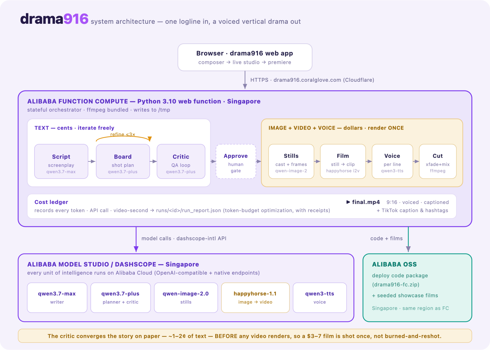

# drama916 — one logline in, a voiced vertical drama out

An autonomous AI showrunner for the Qwen Cloud Hackathon (**AI Showrunner** track): give it a single logline and it writes the screenplay, plans the shots, **critiques the storyboard *before* spending a single video credit**, paints the frames, turns each still into motion, voices every line, and cuts a TikTok-ready 9:16 short — with a copy-ready caption and hashtags.

**Live demo:** https://drama916.coralglove.com &nbsp;·&nbsp; **Runs on Alibaba Cloud** (Function Compute + OSS + Model Studio, Singapore)



## Why the pre-generation critic matters

Video generation is the expensive step. Most pipelines iterate *after* rendering — burn, look, re-burn. drama916 runs a director-critic loop over the shot list while it is still text (fractions of a cent per round), and only sends prompts to HappyHorse once the storyboard passes. Every token, API call and video-second is recorded in a cost ledger (`runs/<id>/run_report.json`) — this is the track's "token budget optimization" criterion, with receipts.

## Pipeline

```
logline ─► script_agent (qwen3.7-max) ─► shot_planner (qwen3.7-plus)
                 ▲                              │
                 └──── critic loop (≤3 rounds, text-only, cheap) ◄──┘
                                                │ approved storyboard  ← human approval gate
                            storyboard (qwen-image-2.0-pro)   cast sheets + stills
                                                │
                            film (happyhorse-1.1-i2v)  each still → clip
                            voice (qwen3-tts-flash)    a voice per character
                                                │
                            assemble (ffmpeg)  crossfade + time-aligned dialogue
                                                ▼
                                        runs/<id>/final.mp4  (9:16, voiced)
```

## Runs on Alibaba Cloud

Every unit of intelligence executes on Alibaba Cloud Model Studio / DashScope (Singapore). Proof — the code that calls it:

- [`showrunner/llm.py`](showrunner/llm.py) + [`showrunner/config.py`](showrunner/config.py) — the OpenAI-compatible DashScope endpoint (`dashscope-intl`) and the Qwen model ids
- [`showrunner/storyboard.py`](showrunner/storyboard.py) — `qwen-image-2.0-pro` image generation (native endpoint)
- [`showrunner/video_gen.py`](showrunner/video_gen.py) — `happyhorse-1.1-i2v` image-to-video tasks
- [`showrunner/tts.py`](showrunner/tts.py) — `qwen3-tts-flash` voice-over

The backend is deployed as a **Function Compute** Python 3.10 web function, with the code package and seeded showcase films on **OSS** — see [`DEPLOY.md`](DEPLOY.md).

## Quickstart (local, 5 minutes)

```bash
python -m venv .venv && source .venv/bin/activate
pip install -r requirements.txt
cp .env.example .env        # paste your DashScope intl API key
python main.py --smoke      # 1 tiny text call, verifies the key
python main.py "A robot janitor on a space station finds a houseplant" --dry-run
# dry-run: full pipeline, placeholder clips, $0 spent
python web.py               # or: the web UI at http://localhost:8090
```

Requires `ffmpeg` on PATH (`brew install ffmpeg`).

## Safety rails

- `--dry-run` renders placeholder clips locally — the whole pipeline is testable for $0.
- The critic converges the story on cheap text before any video task runs.
- Every stage writes its artifact to `runs/<timestamp>/` so a crashed run resumes without re-spending; `run_report.json` is the itemized cost ledger.
- No fallbacks: a blocked frame is shown honestly with a reason and a Regenerate button; the film can't be shot until every frame is present.

## License

MIT
